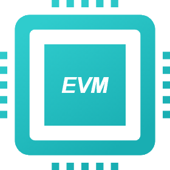
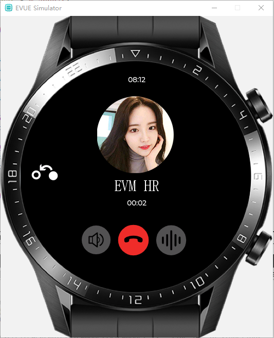
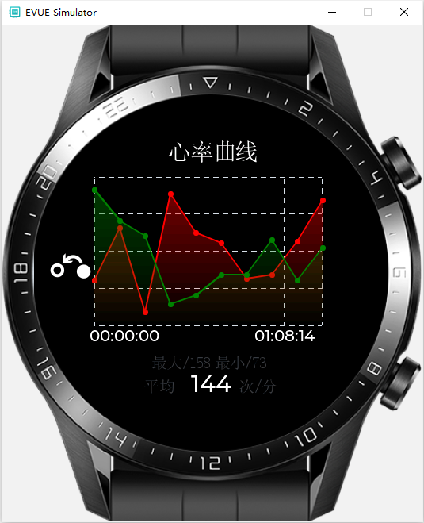
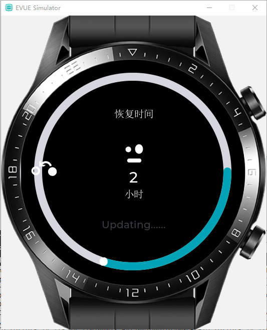

一、EVM3简介
========================================

+ Github 地址： https://github.com/scriptiot/evm
+ Gitee  地址： https://gitee.com/scriptiot/evm

###  1.  EVM 是什么

 **`EVM`** 全称 `Embedded Virtural Machine`，本质上是一款通用、精简的嵌入式虚拟机，由语法解析前端框架和字节码运行后端构成，可运行在资源受限制的单片机上。

### 2. EVM 技术架构

### 3. EVM 优势特点

+ 纯C开发、零依赖、跨平台、内置REPL；
+ 最小编译体积50KB，最小内存占用2KB;
+ 支持多语言混合开发;
+ 先进的内存管理，无内存泄露和内存碎片问题;
+ 灵活的虚拟机扩展技术，多语言可共享扩展功能;

### 4. EVM愿景

> `万物互联，因我们而简单`

打破物联网和互联网人才边界，赋能物联网企业和开发者全新的开发模式，降低物联网开发门槛，极速提升开发效率。

二、EVM 代码目录
======================================== 

## 1. 目录结构介绍

| 文件      |    说明|
| :-------- | --------:|
| **bsp**| 开发板适配目录 |
| **components**| 第三方组件目录 |
| **docs**| 图片文档资源目录 |
| **include**|   头文件目录  | 
| **lib**|   静态库  |
| **modules**|  模块目录  |
| **os**|  操作系统支持 |
| **sdk**|  第三方工具链 |
| **test**|   测试代码 |
| **tools**|  工具 |

三、EVM 在线帮助手册
========================================

+ [evm在线帮助手册Github](https://scriptiot.github.io/evm_doc/#/zh-cn/evm_what)
+ [evm在线帮助手册Gitee](https://scriptiot.gitee.io/evm_doc/#/zh-cn/evm_what)

四、基于EVUE的智能穿戴应用展示
========================================

## 1. 启动页面

## 2. 首页

## 3. 电话

## 4. 运动曲线

## 5. 音乐应用

## 6. 天气应用

## 7. 运动记录

## 8. 更新

五、贡献代码
========================================
+ 在您自己的GitHub账户下Fork **`EVM`** 开源项目；
+ 根据您的需求在本地clone 一份 **`EVM`** 代码；
+ 您修改或者新增功能后，push 到您fork的远程分支；
+ 创建 pull request，向 **`EVM`** 官方开发分支提交合入请求；
+ **`EVM`** 研发团队会定期review代码，通过测试后合入。

六、加入EVM
========================================

技术创造未来，**EVM**团队需要你的参与，**EVM**团队现面向社区招募有激情有梦想的社区开发者，共同开创物联网新生态；
无论你的技术背景如何，你都可以为EVM的成长贡献一份微薄之力，**EVM**团队欢迎你！

## 1. EVM生态开发者联盟

`EVM生态开发者联盟`是EVM团队面向社区成立的深度开发者爱好群，在这里你可以：

+ 随时掌握EVM的最新技术动态，学习物联网最高效的开发方式
+ 参与EVM未来战略的制定和未来的发展路线规划
+ 享受EVM团队零距离接触，欢迎加入EVM团队共创未来
+ 享受EVM企业版无偿技术支持，多种技术解决方案自由分享

> 如果群二维码失效，请加微信号dragondjf，备注：`张三--虚拟机爱好者--武汉`， 第一时间会拉你入群，谢谢！

## 2. EVM英雄帖

EVM处于创业高速成长期，欢迎有志之士加入，共同开辟物联网新生态！

+ 如果你对虚拟机技术或是如何实现一门语言感兴趣，我们欢迎你；
+ 如果你对js、python和c语言都拥有深度的理解和应用，我们欢迎你；
+ 如果你对RTOS都拥有深度的理解和应用, 深度研究过一个或多个RTOS核心源码的高级C语言开发者，我们欢迎你；
+ 如果你精通各种物联网协议和驱动移植，我们欢迎你；

坐标地点：武汉，英雄辈出的城市！

感兴趣的朋友可以发送简历到邮箱：scriptiot@aliyun.com， 欢迎你的加入, 待遇期权股份随你选！

## 3. EVM官方QQ交流群

> 群号：`399011436`

## 4. 关注EVM公众号

> 公众号名称： `EVM字节码`

## 5. 联系我们

+ 论坛： [EVM官方技术交流论坛](http://forum.evmiot.com/)
+ 邮箱： scriptiot@aliyun.com

欢迎大家通过 `GitHub issues`、`邮件` `论坛` 或 `QQ群`反馈问题和联系我们。
