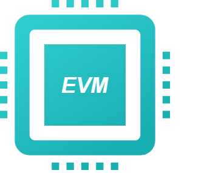
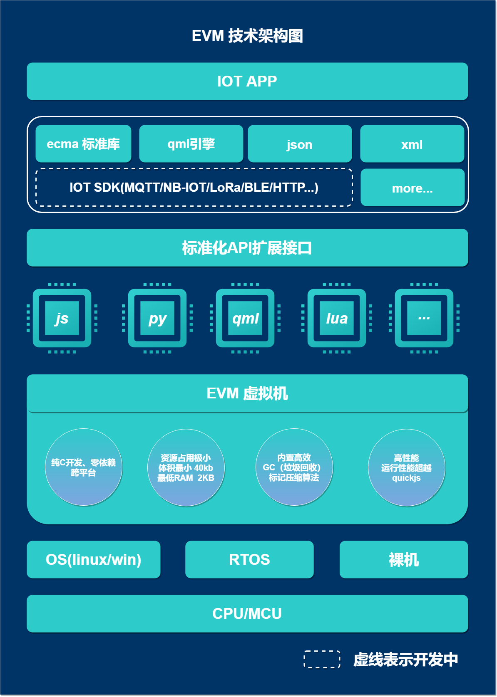

一、EVM简介
========================================

+ GIthub 地址： https://github.com/scriptiot/evm
+ Gitee  地址： https://gitee.com/scriptiot/evm

###  1.  EVM 是什么

 **`EVM`** 全称 `Embedded Virtural Machine`，本质上是一款通用、精简的嵌入式虚拟机，由语法解析前端框架和字节码运行后端构成，可运行在资源受限制的单片机上。

### 2. EVM 技术架构

### 3. EVM 优势特点

+ 最小编译体积40KB，最小内存占用2KB;
+ 支持多语言混合开发，目前支持Javascript、Python、Lua、QML、Json、XML等语言;
+ 先进的内存管理，无内存泄露和内存碎片问题;
+ 高效的运行性能，性能媲美QuickJs;
+ 灵活的虚拟机扩展技术，多语言可共享扩展功能;

### 4. EVM愿景

> `万物互联，因我们而简单`

打破物联网和互联网人才边界，赋能物联网企业和开发者全新的开发模式，降低物联网开发门槛，极速提升开发效率。

二、EVM 代码目录
======================================== 

| 文件      |    说明|
| :-------- | --------:|
| **ejs**| ejs目录 |
| **ejs/bin/ejs**| ejs二进制程序 |
| **ejs/bin/ejs.json**| ejs二进制程序堆栈信息配置 |
| **ejs/bin/ejs_modules**| ejs二进制程序库寻找路径 |
| **ejs/test**|   ejs语法测试用例  | 
| **ejs/README.md**|   ejs说明文档 |
| **inlcude**|    evm虚拟机接口头文件目录|
| **inlcude/evm.h**|    evm虚拟机接口头文件|
| **include/qml_module.h**| qml接口头文件|
| **lib**|    静态库目录 |
| **lib/arm_windows_armcc/libqml.lib**|  windows平台libqml静态库(armcc, Keil)|
| **lib/x86_64_linux_gnu/linux/libejs.a**|  Linux平台libejs静态库 （gcc7 64位）|
| **lib/x86_64_linux_gnu/linux/libqml.a**|  Linux平台libqml静态库 （gcc7 64位）|
| **lib/x86_64_windows_mingw/libejs.a**|  windows平台libejs静态库(MinGW-gcc 64位)|
| **lib/x86_64_windows_mingw/libqml.a**|  windows平台libqml静态库(MinGW-gcc 64位)|
| **thirds/littevgl_qml**| littevgl_qml模块| 
| **thirds/littevgl_qml/lvgl_module**| 基于littlelvgl的qml封装| 
| **thirds/littevgl_qml/ports**| 第三方平台适配| 
| **thirds/littevgl_qml/ports/Qt**| Qt平台适配|
| **thirds/littevgl_qml/ports/stm32**| stm32平台(Keil工程)适配| 
| **thirds/littlevgl_qml/ports/stm32/stm32f103-fire-arbitrary**| stm32平台(Keil工程)野火开发板适配| 
| **thirds/littevgl_qml/test/**|    测试用例目录 |
| **thirds/littevgl_qml/README.md**|    littevgl_qml说明文档 |
| **README.md**|   evm说明文档 |

三、EVM 相关参考文档
========================================

+ [ejs 帮助文档](ejs/README.md)
+ [littevgl_qml 帮助文档](thirds/littlevgl_qml/README.md)
+ [stm32f103-fire-arbitrary野火开发板移植帮助文档](thirds/littlevgl_qml/ports/stm32/stm32f103-fire-arbitrary/README.md)

四、EVM 相关demo展示
========================================

+ [watch](thirds/littlevgl_qml/test/qml/watch.qml)

|      |
| :--------: |
| |
||

五、 EVM问卷调查
========================================

> **欢迎大家投票，选出你最喜欢的物联网开发语言， EVM团队会优先支持!**

[EVM支持多语言开发物联网，你最希望支持的语言是哪一种语言?](https://www.wenjuan.com/s/Qre6Vf/)

六、贡献代码
========================================
+ 在您自己的GitHub账户下Fork **`EVM`** 开源项目；
+ 根据您的需求在本地clone 一份 **`EVM`** 代码；
+ 您修改或者新增功能后，push 到您fork的远程分支；
+ 创建 pull request，向 **`EVM`** 官方开发分支提交合入请求；
+ **`EVM`** 研发团队会定期review代码，通过测试后合入。

七、加入EVM官方QQ技术交流群
========================================

> 群号：**`399011436`**

八、联系我们
========================================
+ 论坛： [EVM官方技术交流论坛](http://47.105.117.50/discuzx/upload/)
+ 邮箱： scriptiot@aliyun.com

欢迎大家通过 `GitHub issues`、`邮件` `论坛` 或 `QQ群`反馈问题和联系我们。
