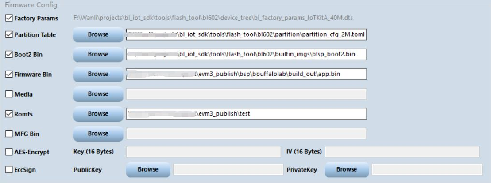

# eluaOS API模块

模块 | 描述
---|----
[socket](luat_lib_socket.md) | socket操作库
[wlan](luat_lib_wlan.md) | wifi操作库 
[pwm](luat_lib_pwm.md) | PWM模块
[gpio](luat_lib_gpio.md) | GPIO操作
[fs](luat_lib_fs.md) | 文件操作
[http](luat_lib_http.md) | http操作

# 如何编译博流BL602

## 步骤

1. 安装Git，克隆evm仓库.
```
git clone https://gitee.com/scriptiot/evm.git evm3
cd evm3
git checkout dev3.1
git submodule update --init --recursive
```
2. 打开终端，进入bsp/bouffalolab目录，输入
```
cd bsp/bouffalolab
./genromap
```
3. 下载博流固件烧写工具： https://dev.bouffalolab.com/download
4. 配置烧写工具：
+ 串口选择第一个（该开发板有两个串口）
+ 波特率设置为2000000（2M）


具体操作方法是：
+ 按住BOOTSTRAP键不松手
+ 点按RST键
+ 松开BOOTSTRAP键
+ 然后在烧录工具点击：Create & Download 按钮

烧写工具需要勾选：
+ Factory Params，选择对应芯片的dts文件。
+ Partition Table，选择对应芯片的分区表文件。
+ Boot2 Bin
+ Firmware Bin，选择编译好的固件，在build_out目录下的app.bin
+ Romfs，选择运行的脚本文件，只需要选择bsp/bouffalolab/test目录即可，烧写工具会将目录内所有文件烧写到开发板。


